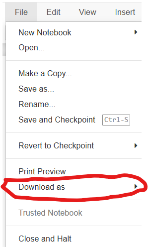
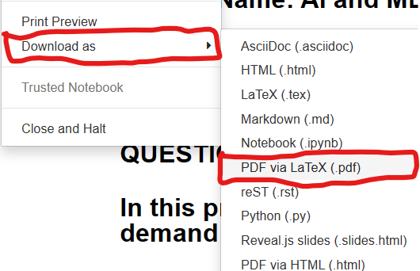

<!-- 
📷 Update Images
📖 Update Readme
🔰 Update License
💻 Update Files
-->

> [](https://github.com/creativepuru "Purushottam Anand 🇮🇳 on GitHub ☕ Tap to see 👆🏻")

[](https://github.com/creativepuru)

<b>

<div align="center"> 

[+file+to+PDF+file)](https://github.com/creativepuru/Convert-ipynb-to-PDF)

</div>

# 📚 Table of Contents
### 🔰 [ABOUT](#about)
### 👨‍💻 [STEPS](#steps)
- [STEP 1](#step-1)
- [STEP 2](#step-2)
- [STEP 3](#step-3)
- [STEP 4](#step-4)
- [STEP 5](#step-5)
- [STEP 6](#step-6)
### 📣 [FEEDBACK & CONTRIBUTIONS 🤝](#feedback--contributions)
### 📖 [LICENSE](#license)
### 📲 [REACH ME](#reach-me)

# ABOUT
### ✨ This repository provides a simple and convenient way to convert Jupyter Notebook (ipynb) files to PDF format 🤓

### ✨ By following the instructions properly which are mentioned below, you can easily convert any Jupyter Notebook (.ipynb) file to PDF file 🚀

# STEPS

### STEP 1
### To get started, at first you'll need to have `Python` installed on your computer. You can download the latest version of Python from the official website: https://www.python.org/downloads/

### STEP 2
### Now Install `Anaconda Navigator` from the official website: https://docs.anaconda.com/free/anaconda/install/ 

### STEP 3
### Now you need to install `nbconvert` tool. To install nbconvert, follow the below mentioned steps:

- 1. Open the `command prompt` or terminal

- 2. Run the following command to install nbconvert using pip:
```
pip install nbconvert
```
- This command will download and install the nbconvert package and its dependencies. Wait for the installation to complete. You should see the progress in the command prompt or terminal.

### STEP 4
### Now you need to install `Pandoc` in addition to nbconvert if you want to convert .ipynb files to PDF format. Pandoc is a separate tool that nbconvert relies on for the conversion process.

- To install Pandoc, follow the below mentioned steps:


- Visit the Official Pandoc website at: https://pandoc.org/installing.html and download the appropriate installer for your operating system.

- Run the installer and follow the on-screen instructions to install `Pandoc`

- After the installation is complete, you can verify the installation by running the following command in the command prompt or terminal:
```
pandoc --version
```

- If the installation was successful, you should see the version information for Pandoc.

### 🔰 NOTE : RESTART your Device 💻 (Laptop or Desktop) after installing `nbconvert` and `pandoc`

----------------------------------------------------------------

### STEP 5
### Now the final tool that you will need is the `TeX` tool. 

- For converting notebooks to PDF (with --to pdf), nbconvert makes use of `LaTeX` and the `XeTeX` as the rendering engine.

- To install a complete TeX environment (including XeLaTeX and the necessary supporting packages) by hand can be tricky. Fortunately, there are packages that make this much easier.

- Because nbconvert depends on packages and fonts included in standard `TeX distributions`, if you do not have a complete installation, you may not be able to use nbconvert’s standard tooling to convert notebooks to PDF. These packages are specific to different `operating systems`. 

### Follow the below links as per your Operating System (OS) to `install` TeX:

- 1. [Windows](https://tug.org/texlive/windows.html)
- 2. [MacOS](https://tug.org/mactex/)
- 3. [Linux](https://tug.org/texlive/quickinstall.html)

### Alternatively, you can also visit the Official website of TeX Live here: https://tug.org/texlive/

### 🔰 NOTE : TeXlive is a large distribution, and installing it might consume a significant amount of disk space. It has over 4000+ files. It might take 1-2 hours (depending upon the system) for TeX Live to install in your device. 


### 🔰 So be patient and leave the rest on installer.

### 🔰 Once you have `nbconvert`, `Pandoc` and `TeX` installed, you should be able to convert Jupyter Notebook (.ipynb) files to PDF

### 👉🏻 Now you can easily convert your `Jupyter Notebook` file to `PDF` file without any error using the `Anaconda Navigator` which you have installed in [Step No. 2](#steps)

----------------------------------------------------------------

### STEP 6
### Using Anaconda Navigator
### After successfully completing all the above mentioned steps, now you are ready to go.
### Follow the below instructions carefully to convert your `Jupyter Notebook` file to `PDF` file using the `Anaconda Navigator` :

### Step 1 : Open Anaconda Navigator. Then Launch the `Jupyter Notebook`


### Step 2 : `Upload` then `Open` your Notebook File


### Step 3 : Go to `File` > `Download as`


### Step 4 : Select `PDF via LaTeX (.pdf)`


### Step 5 : Done


- A new blank window will open up now and your conversion will be done in few seconds/minutes (depending upon the system).

### ☕ So be patient, have a Coffee, and leave the rest. You can also [](https://www.buymeacoffee.com/creativepuru) here 😊

# FEEDBACK & CONTRIBUTIONS
If you have any suggestions for improving the code or adding new notebooks, feel free to submit a pull request. We welcome contributions from the community.

- Fork the project
- Create a new branch (git checkout -b feature/awesome-feature)
- Make your changes and commit them (git commit -am 'Add an awesome feature')
- Push to the branch (git push origin feature/awesome-feature)
- Create a pull request

### ❤️ Thank you for visiting my repository, and happy exploring 🤗

# LICENSE
### My [ "Convert ipynb to PDF" repository](https://github.com/creativepuru/Convert-ipynb-to-PDF) is licensed under the [Standard MIT License](https://github.com/creativepuru/Python-Basics/blob/main/LICENSE.txt) License. 
- See [LICENSE](https://github.com/creativepuru/Python-Basics/blob/main/LICENSE.txt) for more information.
<br> </br>

</b>

# REACH ME
<p align="center">
<a href="https://openinapp.co/connect-on-linkedin-puru">
    
</a> </p>

[](https://www.buymeacoffee.com/creativepuru)

[](https://openinapp.co/githubsponsorpuru "Purushottam Anand's GitHub Sponsors Page")

<!-- Back to TOP -->
<p align="right">
<a href="#top">
 </a> </p>

<!-- Footer -->
<p align="center">
  
</p>
